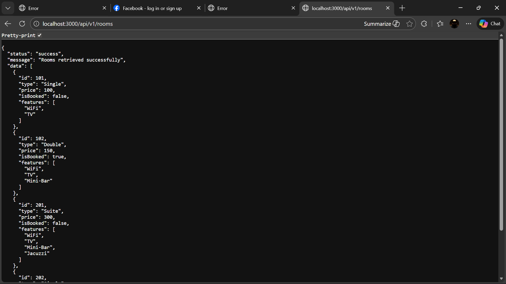

# RESTful API Activity - Earl Jhon Gutierrez

## Best Practices Implementation

**1. Environment Variables:**
- Why did we put `BASE_URI` in `.env` instead of hardcoding it?
- Answer: Environment variables allow for better configuration management across different environments (development, staging, production). It keeps sensitive or environment-specific settings out of the codebase, making the application more secure and flexible. Hardcoding would require code changes for different deployments.

**2. Resource Modeling:**
- Why did we use plural nouns (e.g., `/rooms`) for our routes?
- Answer: Using plural nouns for resource routes follows REST conventions where endpoints represent collections of resources. For example, `/rooms` represents the collection of all rooms, while `/rooms/:id` represents a specific room within that collection. This makes the API more intuitive and consistent.

**3. Status Codes:**
- When do we use `201 Created` vs `200 OK`?
- Why is it important to return `404` instead of just an empty array or a generic error?
- Answer: `201 Created` is used for POST requests when a new resource is successfully created, indicating the location of the new resource. `200 OK` is used for successful GET, PUT, and DELETE operations that don't create new resources. Returning `404 Not Found` for non-existent resources is important because it clearly distinguishes between an empty collection (which might return 200 with an empty array) and a request for a resource that doesn't exist. This provides better error handling and helps clients understand the exact nature of the response.

**4. Testing:**

# Gutierrez-api-activity
